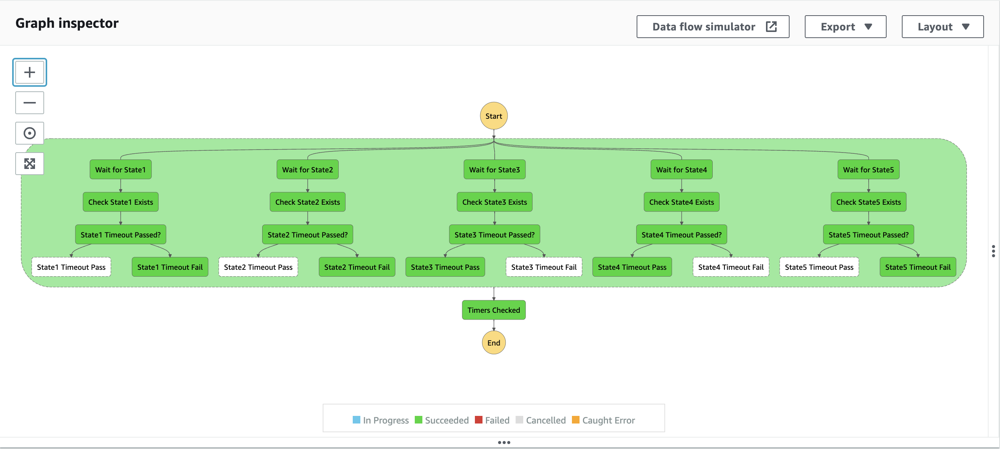

# Welcome to your CDK TypeScript project

This app creates a very simple state machine that runs parallel workflows:

The `cdk.json` file tells the CDK Toolkit how to execute your app.

## Our Use Case
1. We are managing a retail Order Management System (OMS)
1. For every order that is placed, we want to validate that the order status has been updated to a specific value (state) within a specific amount of time (timeout SLA).
1. If the order status was updated to the expected value within the given SLA, we will simply complete that workflow.
1. If the order status was not updated to the expected value within the given SLA, for simplicity's sake, we will fail the workflow. *in the real world, we would probably take some action if the order failed to meet the SLA*
1. We need to repeat Steps 2–4 for as many Statuses / SLAs we have defined.
## Useful commands

* `npm run build`   compile typescript to js
* `npm run watch`   watch for changes and compile
* `npm run test`    perform the jest unit tests
* `cdk deploy`      deploy this stack to your default AWS account/region
* `cdk diff`        compare deployed stack with current state
* `cdk synth`       emits the synthesized CloudFormation template
